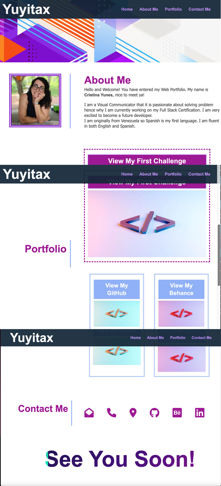
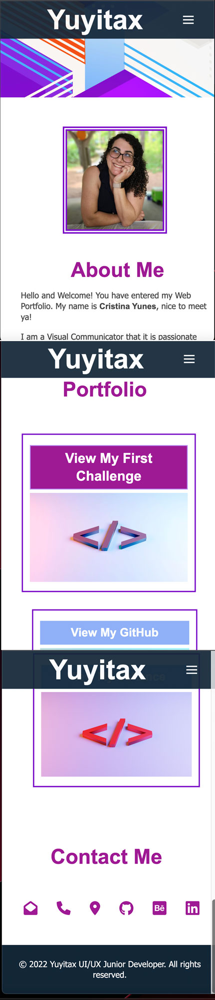

# Yuyitax Full Stack Portfolio

In this challenge I will demonstrate what I've learned in CSS and HTML so far. This website is fully responsive for any screens. 

# Criteria needed to complete this challenge

```
GIVEN I need to sample a potential employee's previous work
WHEN I load their portfolio
THEN I am presented with the developer's name, a recent photo or avatar, and links to sections about them, their work, and how to contact them
WHEN I click one of the links in the navigation
THEN the UI scrolls to the corresponding section
WHEN I click on the link to the section about their work
THEN the UI scrolls to a section with titled images of the developer's applications
WHEN I am presented with the developer's first application
THEN that application's image should be larger in size than the others
WHEN I click on the images of the applications
THEN I am taken to that deployed application
WHEN I resize the page or view the site on various screens and devices
THEN I am presented with a responsive layout that adapts to my viewport
```


# Credit/ Usage

The animated text at the end of the page and the hamburger menu were both found on google. I manipulated the code to fit it withing my design. 

## Animated tex CSS

For this code All credit goes to Álvaro from codepen.io: [Link to the source](https://codepen.io/alvarotrigo/pen/PoKMyNO)

  .animated-text {
    background-image: linear-gradient(
      -225deg,
      #231557 1%,
      #44107a 29%,
      #9e1a94 70%,
      #00ffbb 100%
    );
    background-size: auto auto;
    background-clip: border-box;
    background-size: 200% auto;
    color: #fff;
    background-clip: text;
    text-fill-color: transparent;
    -webkit-background-clip: text;
    -webkit-text-fill-color: transparent;
    animation: textclip 3s reverse infinite;
    display: inline-block;
        font-size: 7rem;
  }

  @keyframes textclip {
    to {
      background-position: 200% center;
    }
  }

  ## Hamburger Menu
  All rights for the Hamburger menu were learned using youtube. [This is the direct link to the youtube video](https://www.youtube.com/watch?v=flItyHiDm7E)


# Mock-Up

The following animation shows the web application's appearance and functionality. These images will mock up the function of the sticky menu as you go to the various areas of the page. Please note that both images below are a combiation of multiple screenshots.






 **Please visit the final product here: [View my portfolio](https://yuyitax.github.io/02-css-challenge/)


© 2022 Cristina Yunes. All Rights Reserved.
